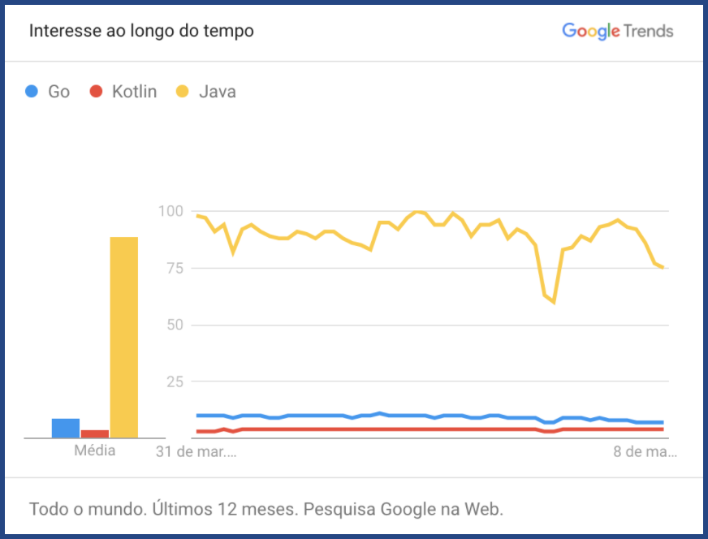
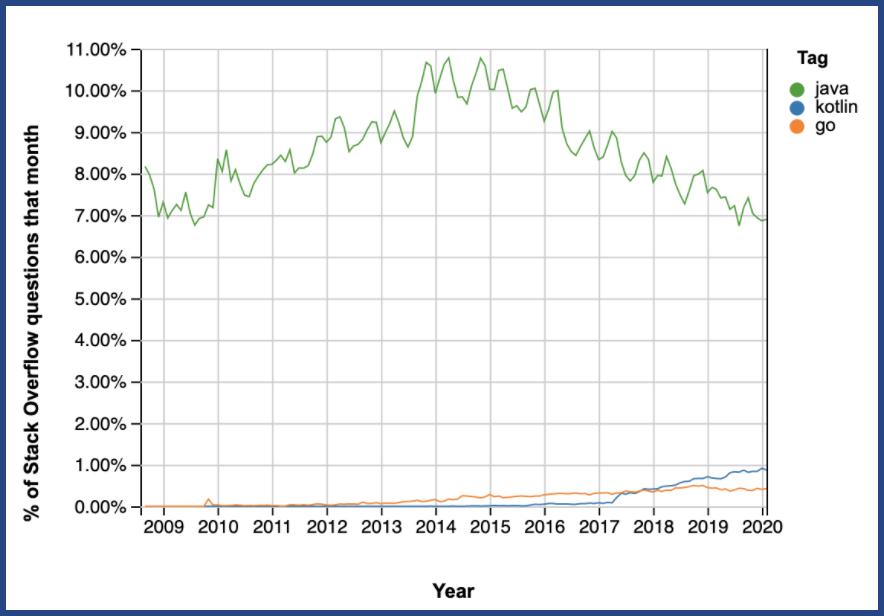
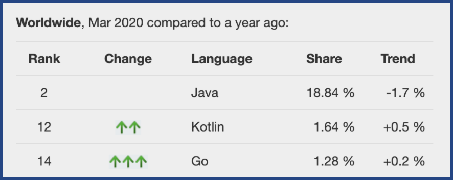
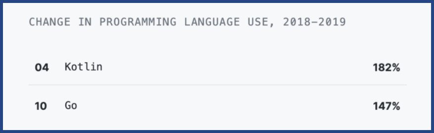
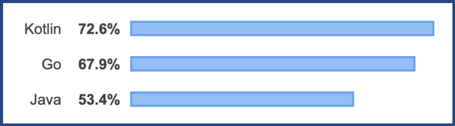
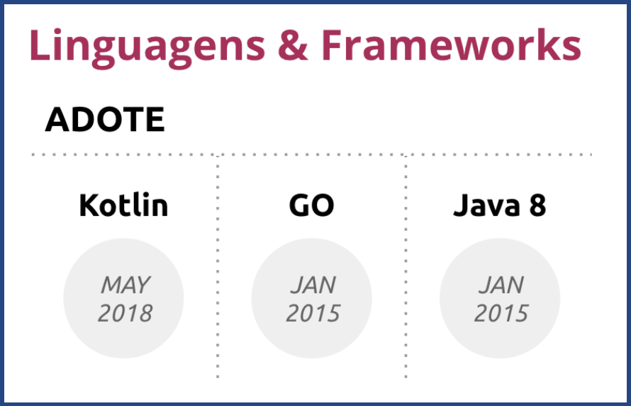
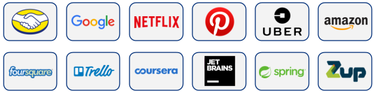

# História

Em julho de 2011 a JetBrains revelou o Projeto Kotlin, no qual já estava trabalhando havia um ano. [Dmitry Jemerov](https://pt.wikipedia.org/w/index.php?title=Dmitry_Jemerov&action=edit&redlink=1) (líder de desenvolvimento) disse que a maioria das linguagens não possuíam as características que eles da JetBrains estavam procurando, com exceção da linguagem [Scala](https://pt.wikipedia.org/wiki/Scala_(linguagem_de_programa%C3%A7%C3%A3o)), no entanto, Dmitry Jemerov citou que o tempo de compilação lenta do Scala era uma deficiência óbvia. Um dos objetivos declarados da Kotlin é compilar tão rápido quanto Java. Em Fevereiro de 2012, a JetBrains abriu o projeto Kotlin sob a [Licença Apache](https://pt.wikipedia.org/wiki/Licen%C3%A7a_Apache) de [Código aberto](https://pt.wikipedia.org/wiki/C%C3%B3digo_aberto). 

Kotlin v1.0 foi lançada em 15 de fevereiro de 2016. Este é considerado o primeiro lançamento oficialmente estável e a JetBrains comprometeu-se com a compatibilidade com versões anteriores a partir desta versão.

No [Google I/O](https://pt.wikipedia.org/wiki/Google_I/O) 2017, o [Google](https://pt.wikipedia.org/wiki/Google) anunciou suporte oficial para o Kotlin no [Android](https://pt.wikipedia.org/wiki/Android) e um pouco mais tarde tornando se a linguagem oficial da plataforma.

O líder de desenvolvimento, [Andrey Breslav](https://pt.wikipedia.org/w/index.php?title=Andrey_Breslav&action=edit&redlink=1), disse que Kotlin é projetada para ser uma linguagem orientada a objeto de força industrial, nascida e feita para resolver problemas da indústria, nao como as outras que normalmente nasceram na academia e que Kotlin deve ser uma linguagem melhor do que Java, mas ainda ser totalmente interoperável com código Java, permitindo que as empresas possam fazer uma migração gradual de Java para Kotlin, [Kotlin também foi inspirada](https://kotlinlang.org/docs/reference/faq.html#is-kotlin-hard) em recursos de outras linguagens além de Java como C#, JavaScript, Scala e Groovy.

Atualmente Kotlin é mantido por uma fundação, onde empresas como JetBrains, Google, Netflix, Uber, etc, já investiram ou investem com mão de obra e financeiramente no desenvolvimento e continuidade da linguagem, essa função se chama [Kotlin Foundation](https://kotlinlang.org/foundation/kotlin-foundation.html).

## O Kotlin é de código aberto?

[Kotlin é a licenciado sobre de Software Apache](https://github.com/JetBrains/kotlin#license), Versão 2.0 ("Apache 2.0").

## Versões

**Kotlin é** constantemente atualizada, com correções de bugs e novas features e ferramentas, atualmente Kotlin está na versão: **1.3.70** e **1.4-M1**.

# Comunidade

Abaixo mostramos um pouco sobre o que a comunidade vem falando sobre essas 3 linguagens citadas anteriormente (Kotlin, Java e Golang), sendo que O Google Threads, vemos o interesse sobre os termos, e no Stack Overflow vemos a utilização, visto que o site é utilizado para tirar dúvidas de uso e funcionamento. 

_Tendência de buscas pelo [Google Trends](https://trends.google.com/trends/explore/TIMESERIES/1585332000?hl=pt-BR&tz=180&q=%2Fm%2F09gbxjr,%2Fm%2F0_lcrx4,%2Fm%2F07sbkfb&sni=3)_

_Tendência de buscas pelo [Stack Overflow](https://insights.stackoverflow.com/trends?tags=kotlin%2Cgo%2Cjava)_

_Popularidade de acordo o site [PYPL](http://pypl.github.io/PYPL.html)_

_Linguagens crescimento mais rápido segundo [GitHub](https://octoverse.github.com/). Java nao aparece nessa lista_

_Linguagens mais amadas segundo [Stack Overflow](https://insights.stackoverflow.com/survey/2019#most-loved-dreaded-and-wanted)_ 

_Tech Radar da ThoughtWorks sobre [Kotlin](https://www.thoughtworks.com/pt/radar/languages-and-frameworks/kotlin), [Go](https://www.thoughtworks.com/pt/radar/languages-and-frameworks/go-language) e [Java](https://www.thoughtworks.com/pt/radar/languages-and-frameworks/java-8). Ambas estão com adote_

**Obs.**: Todas as imagens inseridas aqui, foram coletadas no dia 02/Abril/2020 caso as mesmas forem revisitadas futuramente podem ter diferenças, vale ressaltar também que em algumas, foi suprimido outras linguagens que nao estao em questao aqui, deixando na maioria das imagens apenas Kotlin, Java e Golang.

## Empresas que utilizam

_[Entre outras](https://github.com/ygaller/kotlin-companies/wiki)_
