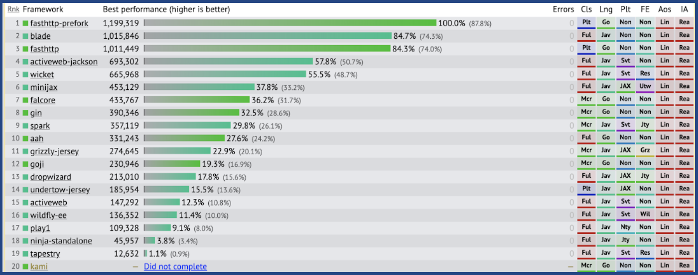
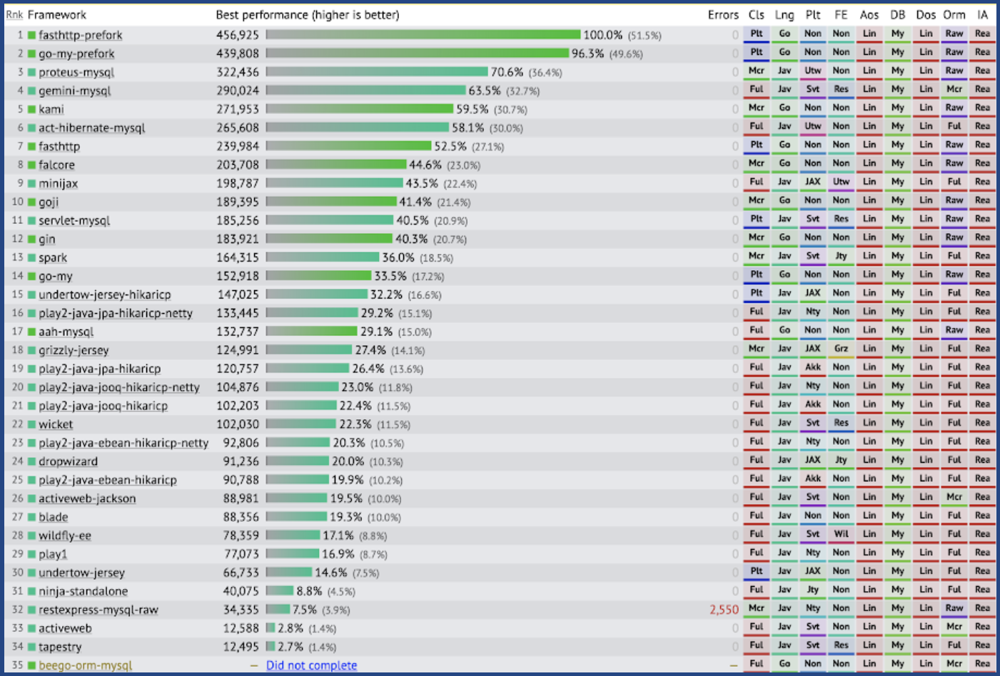

# Benchmarking performance (Kotlin, Go, Java)

Aqui estão alguns comparativos de performance entre as linguagens.

## Web frameworks

Aqui estão o comparativo de performance de serialização Json, consulta simples e complexa em um banco de dados segundo o site [Tech Empower](https://www.techempower.com/benchmarks/#section=data-r18) (round 18), Java também se aplicam a Kotlin nesse caso, visto que a linguagem gera bytecode Java ao ser compilada, e pode usar o mesmo conjunto de ferramentas e frameworks, mais detalhes de como esses testes são feitos e quais cenário podem ser consultados diretamente no site.

### Serialização Json

_Performance de serialização Json, segundo site [Tech Empower](https://www.techempower.com/benchmarks/#section=data-r18&hw=ph&test=json&b=4&l=xamx6n-f&d=d)_

### Query simples em banco de dados

_Performance de query simples em um banco de dados, segundo site [Tech Empower](https://www.techempower.com/benchmarks/#section=data-r18&hw=ph&test=db&b=4&l=xamx6n-f&d=d)_

### Query complexa em banco de dados

_Performance de query complexa em um banco de dados, segundo site [Tech Empower](https://www.techempower.com/benchmarks/#section=data-r18&hw=ph&test=query&b=4&l=xamx6n-f&d=d)_

## Algoritmos

Aqui estão o comparativo de performance de alguns algoritmos famosos, segundo site [Benchmarks Game](https://benchmarksgame-team.pages.debian.net/benchmarksgame/index.html), nesse caso Java também se aplicam a Kotlin, visto que a linguagem gera bytecode Java ao ser compilada, e pode usar o mesmo conjunto de ferramentas e frameworks, mais detalhes de como esses testes são feitos e quais cenário podem ser consultados diretamente no site.

_Performance de algoritmos, segundo site [Benchmarks Game](https://benchmarksgame-team.pages.debian.net/benchmarksgame/fastest/go.html)._

**Fontes**:

* [Kotlin Docs](https://kotlinlang.org/docs/reference/comparison-to-java.html)
* [Udemy Blog](https://www.udemy.com/blog/kotlin-vs-java-9-benefits-of-kotlin-for-your-business/)
