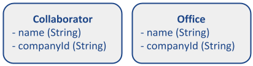

# Exemplos (Kotlin, Go, Java)

Aqui descreveremos alguns problemas para serem resolvidos por algoritmo usando as features de cada linguagem, nesse caso será resolvido nas linguagens Kotlin, Java e Golang.

## UC 01

Neste cenário, temos uma estrutura lógica (observada abaixo), onde recebemos uma relação de pessoas e precisamos retornar uma lista única, ordenada por Estados, em ordem alfabética. Além disso, também só deverão ser retornados os Estados com população igual ou superior à 100 mil habitantes e maiores de 18 anos.


### Exemplos de entrada e saída a serem validados

A implementação contém uma classe/função de serviço que implementa a regra e as funções de teste que validam cada um dos cenários abaixo.

| Cenário | Entrada | Saída |
|:-------:|-------------------------------------------------------------------------------------------------------------------------------------------------------------------------------------------------------------------------------------------------------------------------------------------------------------------------------------------------------------------------------------------------------------------------------------------------------------------------------------------------------------------------------------------------------------------------------------------------------------|:--------:|
| UC01_01 | [<br>Person(name=André Justi, age=null, address=null)<br>] | [] |
| UC01_02 | [<br>Person(name=André Justi, age=null, address=null),<br>Person(name=Maycow Antunes, age=null, address=null)<br>] | [] |
| UC01_03 | [<br>Person(name=Paulo Gustavo, age=17, address=Address(street=Doutor Carlos Maia, city=City(name=Cosmopolis, population=100001, state=State(name=SC))))<br>] | [] |
| UC01_04 | [<br>Person(name=Wellington Macedo, age=19, address=Address(street=Miguel Dutra, city=City(name=Palhoça, population=99999, state=State(name=SC))))<br>] | [] |
| UC01_05 | [<br>Person(name=André Justi, age=28, address=Address(street=Padre Chagas, city=City(name=Florianópolis, population=100001, state=State(name=SC))))<br>] | [SC] |
| UC01_06 | [<br>Person(name=André Justi, age=28, address=Address(street=Padre Chagas, city=City(name=Florianópolis, population=100001, state=State(name=SC)))),<br>Person(name=Wellington Macedo, age=19, address=Address(street=Miguel Dutra, city=City(name=Palhoça, population=99999, state=State(name=SC)))),<br>Person(name=Paulo Gustavo, age=19, address=Address(street=Jose Angelo Peti, city=City(name=Druta, population=99999, state=State(name=SP)))),<br>Person(name=Maycow Antunes, age=19, address=Address(street=Dona Ema, city=City(name=Rio Negrinho, population=100001, state=State(name=RJ))))<br>] | [RJ, SC] |
| UC01_07 | [] | [] |

#### Implementação em Kotlin

```kotlin
package com.mercadolibre.examples.kotlin

import org.junit.jupiter.api.Assertions
import org.junit.jupiter.api.Test

data class State(val name: String? = null)
data class City(val name: String? = null, val population: Int? = null, val state: State? = null)
data class Address(val street: String? = null, val city: City? = null)
data class Person(val name: String? = null, val age: Int? = null, val address: Address? = null)

class PersonService {

   companion object {
      const val AGE_LIMIT_FILTER = 18
      const val POPULATION_LIMIT_FILTER = 100000
   }

   fun getStates(persons: Collection<Person>) = persons
      .filter { it.age ?: 0 >= AGE_LIMIT_FILTER }
      .mapNotNull(Person::address)
      .mapNotNull(Address::city)
      .filter { it.population ?: 0 >= POPULATION_LIMIT_FILTER }
      .mapNotNull(City::state)
      .mapNotNull(State::name)
      .distinct()
      .sorted()
}


class UC01 {

   private val personService = PersonService()

   @Test
   fun `UC01_01`() {
      val persons = listOf(
         Person(name = "André Justi", age = null, address = null)
      )
      val states = personService.getStates(persons)
      Assertions.assertTrue(states.isEmpty())
   }

   @Test
   fun `UC01_02`() {
      val persons = listOf(
         Person(name = "André Justi", age = null, address = null),
         Person(name = "Maycow Antunes", age = null, address = null)
      )
      val states = personService.getStates(persons)
      Assertions.assertTrue(states.isEmpty())
   }

   @Test
   fun `UC01_03`() {
      val persons = listOf(
         Person(name = "Paulo Gustavo", age = PersonService.AGE_LIMIT_FILTER - 1, address = Address(street = "Doutor Carlos Maia", city = City(name = "Cosmopolis", population = PersonService.POPULATION_LIMIT_FILTER + 1, state = State(name = "SC"))))
      )
      val states = personService.getStates(persons)
      Assertions.assertTrue(states.isEmpty())
   }

   @Test
   fun `UC01_04`() {
      val persons = listOf(
         Person(name = "Wellington Macedo", age = PersonService.AGE_LIMIT_FILTER + 1, address = Address(street = "Miguel Dutra", city = City(name = "Palhoça", population = PersonService.POPULATION_LIMIT_FILTER - 1, state = State(name = "SC"))))
      )
      val states = personService.getStates(persons)
      Assertions.assertTrue(states.isEmpty())
   }


   @Test
   fun `UC01_05`() {
      val persons = listOf(
         Person(name = "André Justi", age = PersonService.AGE_LIMIT_FILTER + 10, address = Address(street = "Padre Chagas", city = City(name = "Florianópolis", population = PersonService.POPULATION_LIMIT_FILTER + 1, state = State(name = "SC"))))
      )
      val states = personService.getStates(persons)
      Assertions.assertEquals(listOf("SC"), states)
   }

   @Test
   fun `UC01_06`() {
      val persons = listOf(
         Person(name = "André Justi", age = PersonService.AGE_LIMIT_FILTER + 10, address = Address(street = "Padre Chagas", city = City(name = "Florianópolis", population = PersonService.POPULATION_LIMIT_FILTER + 1, state = State(name = "SC")))),
         Person(name = "Wellington Macedo", age = PersonService.AGE_LIMIT_FILTER + 1, address = Address(street = "Miguel Dutra", city = City(name = "Palhoça", population = PersonService.POPULATION_LIMIT_FILTER - 1, state = State(name = "SC")))),
         Person(name = "Paulo Gustavo", age = PersonService.AGE_LIMIT_FILTER + 1, address = Address(street = "Jose Angelo Peti", city = City(name = "Druta", population = PersonService.POPULATION_LIMIT_FILTER - 1, state = State(name = "SP")))),
         Person(name = "Maycow Antunes", age = PersonService.AGE_LIMIT_FILTER + 1, address = Address(street = "Dona Ema", city = City(name = "Rio Negrinho", population = PersonService.POPULATION_LIMIT_FILTER + 1, state = State(name = "RJ"))))
      )
      val states = personService.getStates(persons)
      Assertions.assertEquals(listOf("RJ", "SC"), states)
   }

   @Test
   fun `UC01_07`() {
      val persons = emptyList<Person>()
      val states = personService.getStates(persons)
      Assertions.assertTrue(states.isEmpty())
   }
}
```

_Essa implementação também pode ser visualizada [aqui](examples/examples-kotlin-java/src/test/kotlin/com/mercadolibre/examples/kotlin/UC01.kt)._

#### Implementação em Java

```java
package com.mercadolibre.examples.java;

import org.junit.jupiter.api.Assertions;
import org.junit.jupiter.api.Test;

import java.util.ArrayList;
import java.util.Arrays;
import java.util.Collection;
import java.util.stream.Collectors;

class State {

   private final String name;


   public State(String name) {
      this.name = name;
   }

   public String getName() {
      return name;
   }
}

class City {

   private final String name;
   private final Integer population;
   private final State state;

   public City(String name, Integer population, State state) {
      this.name = name;
      this.population = population;
      this.state = state;
   }

   public String getName() {
      return name;
   }

   public Integer getPopulation() {
      return population;
   }

   public State getState() {
      return state;
   }
}

class Address {

   private final String street;
   private final City city;

   public Address(String street, City city) {
      this.street = street;
      this.city = city;
   }

   public String getStreet() {
      return street;
   }

   public City getCity() {
      return city;
   }
}

class Person {

   private final String name;
   private final Integer age;
   private final Address address;

   public Person(String name, Integer age, Address address) {
      this.name = name;
      this.age = age;
      this.address = address;
   }

   public String getName() {
      return name;
   }

   public Address getAddress() {
      return address;
   }

   public Integer getAge() {
      return age;
   }
}

class PersonService {

   public static final Integer AGE_LIMIT_FILTER = 18;
   public static final Integer POPULATION_LIMIT_FILTER = 100000;

   public Collection<String> getStates(Collection<Person> persons) {
      if (persons == null) {//VER PARA FAZER COM OPTIONAL
         return new ArrayList<>();
      }
      return persons.stream()
         .filter(person -> person.getAge() != null && person.getAge() >= AGE_LIMIT_FILTER)
         .map(Person::getAddress)
         .map(Address::getCity)
         .filter(city -> city.getPopulation() != null && city.getPopulation() >= POPULATION_LIMIT_FILTER)
         .map(City::getState)
         .map(State::getName)
         .distinct()
         .sorted()
         .collect(Collectors.toList());
   }
}


public class UC01 {

   private PersonService personService = new PersonService();

   @Test
   public void UC01_01() {
      Collection<Person> persons = Arrays.asList(
         new Person("André Justi", null, null)
      );
      Collection<String> states = personService.getStates(persons);
      Assertions.assertTrue(states.isEmpty());
   }

   @Test
   public void UC01_02() {
      Collection<Person> persons = Arrays.asList(
         new Person("André Justi", null, null),
         new Person("Maycow Antunes", null, null)
      );
      Collection<String> states = personService.getStates(persons);
      Assertions.assertTrue(states.isEmpty());
   }

   @Test
   public void UC01_03() {
      Collection<Person> persons = Arrays.asList(
         new Person("Paulo Gustavo", PersonService.AGE_LIMIT_FILTER - 1, new Address("Doutor Carlos Maia", new City("Cosmopolis", PersonService.POPULATION_LIMIT_FILTER + 1, new State("SC"))))
      );
      Collection<String> states = personService.getStates(persons);
      Assertions.assertTrue(states.isEmpty());
   }

   @Test
   public void UC01_04() {
      Collection<Person> persons = Arrays.asList(
         new Person("Wellington Macedo", PersonService.AGE_LIMIT_FILTER + 1, new Address("Miguel Dutra", new City("Palhoça", PersonService.POPULATION_LIMIT_FILTER - 1, new State("SC"))))
      );
      Collection<String> states = personService.getStates(persons);
      Assertions.assertTrue(states.isEmpty());
   }


   @Test
   public void UC01_05() {
      Collection<Person> persons = Arrays.asList(
         new Person("André Justi", PersonService.AGE_LIMIT_FILTER + 10, new Address("Padre Chagas", new City("Florianópolis", PersonService.POPULATION_LIMIT_FILTER + 1, new State("SC"))))
      );
      Collection<String> states = personService.getStates(persons);
      Assertions.assertEquals(Arrays.asList("SC"), states);
   }

   @Test
   public void UC01_06() {
      Collection<Person> persons = Arrays.asList(
         new Person("André Justi", PersonService.AGE_LIMIT_FILTER + 10, new Address("Padre Chagas", new City("Florianópolis", PersonService.POPULATION_LIMIT_FILTER + 1, new State("SC")))),
         new Person("Wellington Macedo", PersonService.AGE_LIMIT_FILTER + 1, new Address("Miguel Dutra", new City("Palhoça", PersonService.POPULATION_LIMIT_FILTER - 1, new State("SC")))),
         new Person("Paulo Gustavo", PersonService.AGE_LIMIT_FILTER + 1, new Address("Jose Angelo Peti", new City("Druta", PersonService.POPULATION_LIMIT_FILTER - 1, new State("SP")))),
         new Person("Maycow Antunes", PersonService.AGE_LIMIT_FILTER + 1, new Address("Dona Ema", new City("Rio Negrinho", PersonService.POPULATION_LIMIT_FILTER + 1, new State("RJ"))))
      );
      Collection<String> states = personService.getStates(persons);
      Assertions.assertEquals(Arrays.asList("RJ", "SC"), states);
   }

   @Test
   public void UC01_07() {
      Collection<Person> persons = Arrays.asList();
      Collection<String> states = personService.getStates(persons);
      Assertions.assertTrue(states.isEmpty());
   }
}
```
_Essa implementação também pode ser visualizada [aqui](examples/examples-kotlin-java/src/test/java/com/mercadolibre/examples/java/UC01.java)._

#### Implementação em Go

```go
import (
   "sort"
   "testing"

   "github.com/stretchr/testify/assert"
)

type State struct {
   Name string
}

type City struct {
   Name       string
   Population int
   State      *State
}

type Address struct {
   Street string
   City   *City
}

type Person struct {
   Name    string
   Age     int
   Address *Address
}

const (
   AgeLimitFilter        = 18
   PopulationLimitFilter = 100000
)

func getStates(persons []Person) (states []string) {
   for _, person := range persons {
      if !isPersonOlderThanLimit(person) {
         continue
      }
      stateName := getStateNameByPersonAndPopulationGreaterLimit(person)
      if stateName==""{
         continue
      }
      if !containsElementInSlice(states, stateName){
         states = append(states, stateName)
      }
   }
   sort.Strings(states)
   return states
}

func containsElementInSlice(slices []string, element string) bool{
   for _,v := range slices{
      if v==element{
         return true
      }
   }
   return false
}

func isPersonOlderThanLimit(person Person) bool {
   return person.Age >= AgeLimitFilter
}

func getStateNameByPersonAndPopulationGreaterLimit(person Person) string {
   address := person.Address
   if address == nil {
      return ""
   }
   city := address.City
   if city == nil || city.Population < PopulationLimitFilter {
      return ""
   }
   if city.State == nil  {
      return ""
   }
   return city.State.Name
}

func Test_UC01_01(t *testing.T) {
   persons := []Person{
      {Name: "André Justi"},
   }
   states := getStates(persons)
   assert.Empty(t, states)
}

func Test_UC01_02(t *testing.T) {
   persons := []Person{
      {Name: "André Justi"},
      {Name: "Maycow Antunes"},
   }
   states := getStates(persons)
   assert.Empty(t, states)
}

func Test_UC01_03(t *testing.T) {
   persons := []Person{
      {Name: "Paulo Gustavo", Age: AgeLimitFilter - 1, Address: &Address{Street: "Doutor Carlos Maia", City: &City{Name: "Cosmopolis", Population: PopulationLimitFilter + 1, State: &State{Name: "SC"}}}},
   }
   states := getStates(persons)
   assert.Empty(t, states)
}

func Test_UC01_04(t *testing.T) {
   persons := []Person{
      {Name: "Wellington Macedo", Age: AgeLimitFilter + 1, Address: &Address{Street: "Miguel Dutra", City: &City{Name: "Palhoça", Population: PopulationLimitFilter - 1, State: &State{Name: "SC"}}}},
   }
   states := getStates(persons)
   assert.Empty(t, states)
}

func Test_UC01_05(t *testing.T) {
   persons := []Person{
      {Name: "André Justi", Age: AgeLimitFilter + 10, Address: &Address{Street: "Padre Chagas", City: &City{Name: "Florianópolis", Population: PopulationLimitFilter + 1, State: &State{Name: "SC"}}}},
   }
   states := getStates(persons)
   assert.Equal(t, []string{"SC"}, states)
}

func Test_UC01_06(t *testing.T) {
   persons := []Person{
      {Name: "André Justi", Age: AgeLimitFilter + 10, Address: &Address{Street: "Padre Chagas", City: &City{Name: "Florianópolis", Population: PopulationLimitFilter + 1, State: &State{Name: "SC"}}}},
      {Name: "Wellington Macedo", Age: AgeLimitFilter + 1, Address: &Address{Street: "Miguel Dutra", City: &City{Name: "Palhoça", Population: PopulationLimitFilter - 1, State: &State{Name: "SC"}}}},
      {Name: "Paulo Gustavo", Age: AgeLimitFilter + 1, Address: &Address{Street: "Jose Angelo Peti", City: &City{Name: "Druta", Population: PopulationLimitFilter - 1, State: &State{Name: "SP"}}}},
      {Name: "Maycow Antunes", Age: AgeLimitFilter + 1, Address: &Address{Street: "Dona Ema", City: &City{Name: "Rio Negrinho", Population: PopulationLimitFilter + 1, State: &State{Name: "RJ"}}}},
   }
   states := getStates(persons)
   assert.Equal(t, []string{"RJ", "SC"}, states)
}

func Test_UC01_07(t *testing.T) {
   var persons []Person
   states := getStates(persons)
   assert.Empty(t, states)
}
```

_Essa implementação também pode ser visualizada [aqui](examples/exemplos-golang/UC01_test.go)._

## UC 02

Nesse cenário foi implementado a sequência de fibonacci onde é informado um número fibonacci válido e o algoritmo retorna a sequência fibonacci até esse número, caso o número informado não seja válido, o algoritmo retorna um erro.

### Exemplos de entrada e saída a serem validados

A implementação contém uma classe/função de serviço que implementa a regra e as funções de teste que validam cada um dos cenários abaixo.

| Cenário | Entrada | Saída |
|:-------:|:--------:|:--------:|
| UC02_01 | 5 | [0, 1, 1, 2, 3] |
| UC02_02 | 8 | [0, 1, 1, 2, 3, 5] |
| UC02_03 | 13 | [0, 1, 1, 2, 3, 5, 8] |
| UC02_04 | 21 | [0, 1, 1, 2, 3, 5, 8, 13] |
| UC02_05 | 34 | [0, 1, 1, 2, 3, 5, 8, 13, 21] |
| UC02_06 | 55 | [0, 1, 1, 2, 3, 5, 8, 13, 21, 34] |
| UC02_07 | 4 | Error(invalid fibonacci number) |


#### Implementação em Kotlin

```kotlin
package com.mercadolibre.examples.kotlin

import org.junit.jupiter.api.*
import org.junit.jupiter.api.Assertions.*

class InvalidFibonacciSequenceException : Exception("you should inform a valid fibonacci sequence")

fun fibonacci() = sequence {
	var terms = Pair(0, 1)
	while (true) {
		yield(terms.first)
		terms = Pair(terms.second, terms.first + terms.second)
	}
}

fun fibonacciUntil(boundary: Int) =
		fibonacci()
				.takeWhile {
					when {
						boundary > it -> true
						boundary == it -> false
						else -> throw InvalidFibonacciSequenceException()
					}
				}
				.toList()

class Expect(private val boundary: Int) {
	fun expect(vararg expected: Int) = assertEquals(expected.asList(), fibonacciUntil(boundary))
}

fun whenFibonacciUntil(boundary: Int) = Expect(boundary)

class UC02 {

	@Test
	fun `UC02 01`() {
		whenFibonacciUntil(5).expect(0, 1, 1, 2, 3)
	}

	@Test
	fun `UC02 02`() {
		whenFibonacciUntil(8).expect(0, 1, 1, 2, 3, 5)
	}

	@Test
	fun `UC02 03`() {
		whenFibonacciUntil(13).expect(0, 1, 1, 2, 3, 5, 8)
	}

	@Test
	fun `UC02 04`() {
		whenFibonacciUntil(21).expect(0, 1, 1, 2, 3, 5, 8, 13)
	}

	@Test
	fun `UC02 05`() {
		whenFibonacciUntil(34).expect(0, 1, 1, 2, 3, 5, 8, 13, 21)
	}

	@Test
	fun `UC02 06`() {
		whenFibonacciUntil(55).expect(0, 1, 1, 2, 3, 5, 8, 13, 21, 34)
	}

	@Test
	fun `UC02 07`() {
		assertThrows<InvalidFibonacciSequenceException> { fibonacciUntil(4) }
	}
}
```

_Essa implementação também pode ser visualizada [aqui](examples/examples-kotlin-java/src/test/kotlin/com/mercadolibre/examples/kotlin/UC02.kt)._

#### Implementação em Java

```java
package com.mercadolibre.examples.java;

import org.junit.jupiter.api.Test;

import java.util.List;
import java.util.stream.IntStream;
import java.util.stream.Stream;

import static java.util.Arrays.asList;
import static java.util.stream.Collectors.toList;
import static org.junit.jupiter.api.Assertions.assertEquals;
import static org.junit.jupiter.api.Assertions.assertThrows;

public class UC02 {

    static class InvalidFibonacciSequenceException extends RuntimeException {

        InvalidFibonacciSequenceException() {
            super("you should inform a valid fibonacci sequence");
        }
    }

	static IntStream fibonacci() {
		return Stream.iterate(new int[]{0, 1}, t -> new int[]{t[1], t[0] + t[1]})
				.map(t -> t[0])
				.mapToInt(Integer::intValue);

	}

	static List<Integer> fibonacciUntil(Integer boundary) {
		return fibonacci()
				.takeWhile(sequence -> {
					if (boundary > sequence) return true;
					else if (boundary == sequence) return false;
					else throw new InvalidFibonacciSequenceException();
				})
				.boxed()
				.collect(toList());
	}

	static class Expect {
		private Integer boundary;

		Expect(Integer boundary) {
			this.boundary = boundary;
		}

		void expect(Integer...expected) {
			assertEquals(asList(expected), fibonacciUntil(boundary));
		}
	}

	static Expect whenFibonacciUntil(Integer boundary) {
		return new Expect(boundary);
	}

	@Test
	public void UC02_01() {
		whenFibonacciUntil(5).expect(0, 1, 1, 2, 3);
	}

	@Test
	public void UC02_02() {
        whenFibonacciUntil(8).expect(0, 1, 1, 2, 3, 5);
	  }

	@Test
	public void UC02_03() {
        whenFibonacciUntil(13).expect(0, 1, 1, 2, 3, 5, 8);
	}

	@Test
	public void UC02_04() {
        whenFibonacciUntil(21).expect(0, 1, 1, 2, 3, 5, 8, 13);
	}

	@Test
	public void UC02_05() {
        whenFibonacciUntil(34).expect(0, 1, 1, 2, 3, 5, 8, 13, 21);
	}

	@Test
	public void UC02_06() {
        whenFibonacciUntil(55).expect(0, 1, 1, 2, 3, 5, 8, 13, 21, 34);
	}

	@Test
	public void UC02_07() {
        assertThrows(InvalidFibonacciSequenceException.class, () -> fibonacciUntil(4));
	}
}
```
_Essa implementação também pode ser visualizada [aqui](examples/examples-kotlin-java/src/test/java/com/mercadolibre/examples/java/UC02.java)._

#### Implementação em Go

```go
package exemplos_golang

import (
	"testing"

	"github.com/magiconair/properties/assert"
	"github.com/mercadolibre/fury_go-ucs-toolkit/pkg/errors"
)

func fibonnaci() func() int {
	a, b := 0, 1
	return func() int {
		a, b = b, a+b
		return a
	}
}

func fibonnaciUntil(boundary int) ([]int, error) {
	fib := fibonnaci()
	sequence := []int{0}
	for true {
		next := fib()
		if boundary > next {
			sequence = append(sequence, next)
			continue
		}
		if boundary == next {
			return sequence, nil
		}
		return nil, errors.New("you should inform a valid fibonacci sequence")
	}
	return sequence, nil
}

func Test_UC02(t *testing.T) {
	testCases := []struct {
		name             string
		boundary         int
		expectedSequence []int
		expectedError    error
	}{
		{
			name:             "01",
			boundary:         5,
			expectedSequence: []int{0, 1, 1, 2, 3},
		},
		{
			name:             "02",
			boundary:         8,
			expectedSequence: []int{0, 1, 1, 2, 3, 5},
		},
		{
			name:             "03",
			boundary:         13,
			expectedSequence: []int{0, 1, 1, 2, 3, 5, 8},
		},
		{
			name:             "04",
			boundary:         21,
			expectedSequence: []int{0, 1, 1, 2, 3, 5, 8, 13},
		},
		{
			name:             "05",
			boundary:         34,
			expectedSequence: []int{0, 1, 1, 2, 3, 5, 8, 13, 21},
		},
		{
			name:             "06",
			boundary:         55,
			expectedSequence: []int{0, 1, 1, 2, 3, 5, 8, 13, 21, 34},
		},
		{
			name:          "07",
			boundary:      4,
			expectedError: errors.New("you should inform a valid fibonacci sequence"),
		},
	}

	for _, tc := range testCases {
		t.Run(tc.name, func(t *testing.T) {
			actual, err := fibonnaciUntil(tc.boundary)
			assert.Equal(t, err, tc.expectedError)
			assert.Equal(t, actual, tc.expectedSequence)
		})
	}
}

```

_Essa implementação também pode ser visualizada [aqui](examples/exemplos-golang/UC02_test.go)._

## UC 03

Neste cenário, temos uma estrutura lógica (observada abaixo), onde recebemos uma relação de colaboradores e seu setor, e precisamos retornar uma listagem agrupando setor, a soma do salário para cada setor e a lista de colabores do mesmo, além disso também deve ser retornado um erro caso o salário seja menor que 0 ou nao informado e caso o colaborador não tenha setor,  ao retornar a lista de colaboradores a mesma deve estar ordenada do maior salário para o menor.

 

### Exemplos de entrada e saída a serem validados

A implementação contém uma classe/função de serviço que implementa a regra e as funções de teste que validam cada um dos cenários abaixo.

| Cenário | Entrada | Saída |
|:-------:|----------|-----------------------------|
| UC03_01 | [] | [] |
| UC03_02 | [<br>Collaborator(name="André Justi", salary = -1, sector=Sector(name="TTW01"))<br>] | Error("salary is required") |
| UC03_03 | [<br>Collaborator(name="Paulo Gustavo", salary = null, sector=Sector(name="XTW04"))<br>] | Error("salary is required") |
| UC03_04 | [<br>Collaborator(name="Wellington Macedo", salary = 100000,00, sector=nul)<br>] | Error("sector is required") |
| UC03_05 | [<br>Collaborator(name="Wellington Macedo", salary = 500000,00, sector=Sector(name="XTW04")),<br>Collaborator(name="Paulo Gustavo", salary = 300000,00, sector=Sector(name="XTW04"))<br>] | <br>{XTW04=SectorSummar{<br>total=800000.0, <br>collaborators=[<br>Collaborator{name='Wellington Macedo', salary=300000.0}, Collaborator{name='Paulo Gustavo', salary=500000.0}]<br>}}<br> |
| UC03_06 | [<br>Collaborator(name="Wellington Macedo", salary = 500000,00, sector=Sector(name="XTW04")),<br>Collaborator(name="Maycow Antunes", salary = 100000,00, sector=Sector(name="TTW01")),<br>Collaborator(name="André Justi", salary = 300000,00, sector=Sector(name="XTW04"))<br>] | {XTW04=SectorSummary{<br>total=800000.0, <br>collaborators=[<br>Collaborator{name='André Justi', salary=300000.0}, Collaborator{name='Wellington Macedo', salary=500000.0}]<br>}, <br>TTW01=SectorSummary{<br>total=100000.0, <br>collaborators=[<br>Collaborator{name='Maycow Antunes', salary=100000.0}]<br>}} |
| UC03_07 | [<br>Collaborator(name="André Justi", salary = 500000,00, sector=Sector(name="XTW04")),<br>Collaborator(name="Paulo Gustavo", salary = 100000,00, sector=Sector(name="TTW01")),<br>Collaborator(name="Wellington Macedo", salary = 300000,00, sector=Sector(name="XTW04")),<br>Collaborator(name="Maycow Antunes", salary = 300000,00, sector=Sector(name="TTW01"))<br>] | {XTW04=SectorSummary{<br>total=800000.0, <br>collaborators=[<br>Collaborator{name='Wellington Macedo', salary=300000.0}, Collaborator{name='André Justi', salary=500000.0}]<br>}, <br>TTW01=SectorSummary{<br>total=400000.0, <br>collaborators=[<br>Collaborator{name='Paulo Gustavo', salary=100000.0}, Collaborator{name='Maycow Antunes', salary=300000.0}]<br>}}
 |

#### Implementação em Kotlin

```kotlin
package com.mercadolibre.examples.kotlin

import org.junit.jupiter.api.Assertions
import org.junit.jupiter.api.Test

data class Sector(val name: String)
data class Collaborator(val name: String, val salary: Double?, val sector: Sector? = null)
data class SectorSummary(val total: Double, val collaborators: List<Collaborator>)

class InvalidSalaryException(message: String) : Exception(message)
class InvalidSectorException(message: String) : Exception(message)

class Collaborators(private val collaborators: List<Collaborator>) {
	fun isSalariesValid(): Boolean {
		return collaborators.none { it.salary == null || it.salary <= 0 }
	}
	fun isSectorsValid(): Boolean {
		return collaborators.none { it.sector == null }
	}
	fun get() : List<Collaborator>{
		return collaborators
	}
}

class SectorService {
	fun compile(collaborators: Collaborators): Map<String?, SectorSummary> {
		validateCollaborators(collaborators)
		return collaborators.get()
				.groupBy { it.sector?.name }
				.mapValues {  parseCollaboratorsToSectorSummary(it.value) }
	}

	private fun parseCollaboratorsToSectorSummary(collaborators: List<Collaborator>) = SectorSummary(
			total = collaborators.sumByDouble { it.salary!! },
			collaborators = collaborators.sortedByDescending { it.salary }
	)

	private fun validateCollaborators(collaborators: Collaborators) {
		if (!collaborators.isSalariesValid()) {
			throw InvalidSalaryException("salary is required")
		}
		if (!collaborators.isSectorsValid()) {
			throw InvalidSectorException("sector is required")
		}
	}
}

class UC03 {

	private val service = SectorService()

	@Test
	fun `UC03_01`() {
		val collaborators = Collaborators(emptyList())
		Assertions.assertTrue(service.compile(collaborators).isEmpty())
	}

	@Test
	fun `UC03_02`() {
		val collaborators = Collaborators(listOf(Collaborator("Paulo", -1.0, Sector("TTW01"))))
		Assertions.assertThrows(InvalidSalaryException::class.java) {
			service.compile(collaborators)
		}
	}

	@Test
	fun `UC03_03`() {
		val collaborators = Collaborators(listOf(Collaborator("Paulo", null, Sector("TTW01"))))
		Assertions.assertThrows(InvalidSalaryException::class.java) {
			service.compile(collaborators)
		}
	}

	@Test
	fun `UC03_04`() {
		val collaborators = Collaborators(listOf(Collaborator("Paulo", 10.0, null)))
		Assertions.assertThrows(InvalidSectorException::class.java) {
			service.compile(collaborators)
		}
	}

	@Test
	fun `UC03_05`() {
		val collaborators = listOf(
				Collaborator("Wellington Macedo", 300000.00, Sector("XTW04")),
				Collaborator("Paulo Gustavo", 500000.00, Sector("XTW04"))
		)
		val compiled = service.compile(Collaborators(collaborators))
		val expected = mapOf(
				"XTW04" to SectorSummary(800000.00, collaborators.sortedByDescending { it.salary })
		)
		Assertions.assertEquals(expected, compiled)
	}

	@Test
	fun `UC03_06`() {
		val collaborators = listOf(
				Collaborator("Wellington Macedo", 500000.00, Sector("XTW04")),
				Collaborator("Maycow Antunes", 100000.00, Sector("TTW01")),
				Collaborator("André Justi", 300000.00, Sector("XTW04"))
		)
		val compiled = service.compile(Collaborators(collaborators))
		val expected = mapOf(
				"XTW04" to SectorSummary(800000.00, collaborators
						.filter { it.sector?.name == "XTW04" }
						.sortedByDescending { it.salary }),
				"TTW01" to SectorSummary(100000.00, collaborators
						.filter { it.sector?.name == "TTW01" })
		)
		Assertions.assertEquals(expected, compiled)
	}

	@Test
	fun `UC03_07`() {
		val collaborators = listOf(
				Collaborator("André Justi", 500000.00, Sector("XTW04")),
				Collaborator("Paulo Gustavo", 100000.00, Sector("TTW01")),
				Collaborator("Wellington Macedo", 300000.00, Sector("XTW04")),
				Collaborator("Maycow Antunes", 300000.00, Sector("TTW01"))
		)
		val compiled = service.compile(Collaborators(collaborators))
		val expected = mapOf(
				"XTW04" to SectorSummary(800000.00, collaborators
						.filter { it.sector?.name == "XTW04" }
						.sortedByDescending { it.salary }),
				"TTW01" to SectorSummary(400000.00, collaborators
						.filter { it.sector?.name == "TTW01" }
						.sortedByDescending { it.salary })
		)
		Assertions.assertEquals(expected, compiled)
	}
}
```

_Essa implementação também pode ser visualizada [aqui](examples/examples-kotlin-java/src/test/kotlin/com/mercadolibre/examples/kotlin/UC03.kt)._

#### Implementação em Java

```java
package com.mercadolibre.examples.java;

import org.junit.jupiter.api.Assertions;
import org.junit.jupiter.api.Test;

import java.util.*;
import java.util.stream.Collectors;

class InvalidSalaryException extends Exception {
    public InvalidSalaryException(String message) {
        super(message);
    }
}

class InvalidSectorException extends Exception {
    public InvalidSectorException(String message) {
        super(message);
    }
}

class Sector {
    private String name;

    public Sector(String name) {
        this.name = name;
    }

    public String getName() {
        return name;
    }
}

class Collaborator {
    private String name;
    private Double salary;
    private Sector sector;

    public Collaborator(String name, Double salary, Sector sector) {
        this.name = name;
        this.salary = salary;
        this.sector = sector;
    }

    public Double getSalary() {
        return salary;
    }

    public Sector getSector() {
        return sector;
    }

    @Override
    public String toString() {
        return "Collaborator{" +
                "name='" + name + '\'' +
                ", salary=" + salary +
                '}';
    }
}

class SectorSummary {
    private Double total;
    private List<Collaborator> collaborators;

    public SectorSummary(Double total, List<Collaborator> collaborators) {
        this.total = total;
        this.collaborators = collaborators;
    }

    @Override
    public String toString() {
        return "SectorSummary{" +
                "total=" + total +
                ", collaborators=" + collaborators +
                '}';
    }

    @Override
    public boolean equals(Object o) {
        if (this == o) return true;
        if (o == null || getClass() != o.getClass()) return false;
        SectorSummary that = (SectorSummary) o;
        return Objects.equals(total, that.total) &&
                Objects.equals(collaborators, that.collaborators);
    }

    @Override
    public int hashCode() {
        return Objects.hash(total, collaborators);
    }
}

class Collaborators {
    private List<Collaborator> collaborators;

    public Collaborators(List<Collaborator> collaborators) {
        this.collaborators = collaborators;
    }

    public boolean isSalariesValid() {
        return this.collaborators.stream().noneMatch(it -> it.getSalary() == null || it.getSalary() < 0);
    }

    public boolean isSectorsValid() {
        return this.collaborators.stream().noneMatch(it -> it.getSector() == null);
    }

    public List<Collaborator> get() {
        return this.collaborators;
    }
}

class SectorService {
    public Map<String, SectorSummary> compile(Collaborators collaborators) throws InvalidSalaryException, InvalidSectorException {
        validateCollaborators(collaborators);
        return collaborators.get()
                .stream()
                .collect(Collectors.groupingBy(c -> c.getSector().getName()))
                .entrySet()
                .stream()
                .collect(Collectors.toMap(Map.Entry::getKey, e -> parseCollaboratorsToSectorSummary(e.getValue())));
    }

    private SectorSummary parseCollaboratorsToSectorSummary(List<Collaborator> collaborators) {
        return new SectorSummary(
                collaborators
                        .stream()
                        .mapToDouble(Collaborator::getSalary).sum(),
                collaborators
                        .stream()
                        .sorted(Comparator.comparingDouble(Collaborator::getSalary))
                        .collect(Collectors.toList())
        );
    }

    private void validateCollaborators(Collaborators collaborators) throws InvalidSalaryException, InvalidSectorException {
        if (!collaborators.isSalariesValid()) {
            throw new InvalidSalaryException("salary is required");
        }
        if (!collaborators.isSectorsValid()) {
            throw new InvalidSectorException("sector is required");
        }
    }
}

public class UC03 {

    private SectorService service = new SectorService();

    @Test
    public void UC03_01() throws InvalidSalaryException, InvalidSectorException {
        Assertions.assertTrue(service.compile(new Collaborators(Collections.emptyList())).isEmpty());
    }

    @Test
    public void UC03_02() {
        List<Collaborator> collaborators = Collections.singletonList(
                new Collaborator("Paulo Gustavo", -1.0, new Sector("TTW01"))
        );
        Assertions.assertThrows(InvalidSalaryException.class, () -> {
            service.compile(new Collaborators(collaborators));
        });
    }

    @Test
    public void UC03_03() {
        List<Collaborator> collaborators = Collections.singletonList(
                new Collaborator("Paulo Gustavo", null, new Sector("TTW01"))
        );
        Assertions.assertThrows(InvalidSalaryException.class, () -> {
            service.compile(new Collaborators(collaborators));
        });
    }

    @Test
    public void UC03_04() {
        List<Collaborator> collaborators = Collections.singletonList(
                new Collaborator("Paulo Gustavo", 10.0, null)
        );
        Assertions.assertThrows(InvalidSectorException.class, () -> {
            service.compile(new Collaborators(collaborators));
        });
    }

    @Test
    public void UC03_05() throws InvalidSalaryException, InvalidSectorException {
        List<Collaborator> collaborators = Arrays.asList(
                new Collaborator("Wellington Macedo", 300000.0, new Sector("XTW04")),
                new Collaborator("Paulo Gustavo", 500000.0, new Sector("XTW04"))
        );
        Map<String, SectorSummary> compiled = service.compile(new Collaborators(collaborators));
        Map<String, SectorSummary> expected = Map.of("XTW04", new SectorSummary(
                800000.0,
                collaborators.stream()
                        .sorted(Comparator.comparingDouble(Collaborator::getSalary))
                        .collect(Collectors.toList())
        ));
        Assertions.assertEquals(expected.get("XTW04"), compiled.get("XTW04"));
        System.out.println(expected);
    }

    @Test
    public void UC03_06() throws InvalidSalaryException, InvalidSectorException {
        List<Collaborator> collaborators = Arrays.asList(
                new Collaborator("Wellington Macedo", 500000.0, new Sector("XTW04")),
                new Collaborator("Maycow Antunes", 100000.0, new Sector("TTW01")),
                new Collaborator("André Justi", 300000.0, new Sector("XTW04"))
        );
        Map<String, SectorSummary> compiled = service.compile(new Collaborators(collaborators));
        Map<String, SectorSummary> expected = Map.of(
                "XTW04", new SectorSummary(
                        800000.0,
                        collaborators.stream()
                                .filter(it -> it.getSector().getName().equals("XTW04"))
                                .sorted(Comparator.comparingDouble(Collaborator::getSalary))
                                .collect(Collectors.toList())
                ),
                "TTW01", new SectorSummary(
                        100000.0,
                        collaborators.stream()
                                .filter(it -> it.getSector().getName().equals("TTW01"))
                                .sorted(Comparator.comparingDouble(Collaborator::getSalary))
                                .collect(Collectors.toList())));

        Assertions.assertEquals(expected.get("XTW04"), compiled.get("XTW04"));
        Assertions.assertEquals(expected.get("TTW01"), compiled.get("TTW01"));

        System.out.println(expected);
    }

    @Test
    public void UC03_07() throws InvalidSalaryException, InvalidSectorException {
		List<Collaborator> collaborators = Arrays.asList(
				new Collaborator("André Justi", 500000.0, new Sector("XTW04")),
				new Collaborator("Paulo Gustavo", 100000.0, new Sector("TTW01")),
				new Collaborator("Wellington Macedo", 300000.0, new Sector("XTW04")),
				new Collaborator("Maycow Antunes", 300000.0, new Sector("TTW01"))
		);
		Map<String, SectorSummary> compiled = service.compile(new Collaborators(collaborators));
		Map<String, SectorSummary> expected = Map.of(
				"XTW04", new SectorSummary(
						800000.0,
						collaborators.stream()
								.filter(it -> it.getSector().getName().equals("XTW04"))
								.sorted(Comparator.comparingDouble(Collaborator::getSalary))
								.collect(Collectors.toList())
				),
				"TTW01", new SectorSummary(
						400000.0,
						collaborators.stream()
								.filter(it -> it.getSector().getName().equals("TTW01"))
								.sorted(Comparator.comparingDouble(Collaborator::getSalary))
								.collect(Collectors.toList())));

		Assertions.assertEquals(expected.get("XTW04"), compiled.get("XTW04"));
		Assertions.assertEquals(expected.get("TTW01"), compiled.get("TTW01"));

        System.out.println(expected);
    }
}
```
_Essa implementação também pode ser visualizada [aqui](examples/examples-kotlin-java/src/test/java/com/mercadolibre/examples/java/UC03.java)._

#### Implementação em Go

```go
package exemplos_golang

import (
	"sort"
	"testing"

	"github.com/mercadolibre/fury_go-ucs-toolkit/pkg/errors"
	"github.com/stretchr/testify/assert"
)

type Sector struct {
	Name string
}

type Collaborator struct {
	Name   string
	Salary *float64
	Sector *Sector
}

type Collaborators []Collaborator

func (c Collaborators) isSalariesValid() bool {
	for _, v := range c {
		if v.Salary == nil {
			return false
		}
		salary := *v.Salary
		if salary < 0 {
			return false
		}
	}
	return true
}

func (c Collaborators) isSectorsValid() bool {
	for _, v := range c {
		if v.Sector == nil {
			return false
		}
	}
	return true
}

type SectorSummary struct {
	Total         float64
	Collaborators []Collaborator
}

type SectorService struct{}

func (s *SectorService) Compile(collaborators Collaborators) (result map[string]SectorSummary, err error) {
	if !collaborators.isSalariesValid() {
		return result, errors.New("salary is required")
	}
	if !collaborators.isSectorsValid() {
		return result, errors.New("sector is required")
	}
	result = make(map[string]SectorSummary)
	for _, v := range collaborators {
		if _, ok := result[v.Sector.Name]; !ok {
			result[v.Sector.Name] = SectorSummary{}
		}
		summary := result[v.Sector.Name]
		summary.Total += *v.Salary
		summary.Collaborators = append(summary.Collaborators, v)

		result[v.Sector.Name] = summary
	}
	s.sortSectorSummaryBySalary(result)
	return
}

func (*SectorService) sortSectorSummaryBySalary(result map[string]SectorSummary) {
	for _, v := range result {
		sort.SliceStable(v.Collaborators, func(i, j int) bool {
			is := *v.Collaborators[i].Salary
			js := *v.Collaborators[j].Salary
			return is > js
		})
	}
}

// --------------------------------- test content -------------------------------------

var (
	negativeSalary = float64(-1)
	salary100000   = float64(100000)
	salary300000   = float64(300000)
	salary500000   = float64(500000)
	TTW01          = Sector{Name: "TTW01"}
	XTW04          = Sector{Name: "XTW04"}
)

func Test_UC03_01(t *testing.T) {
	service := SectorService{}
	result, _ := service.Compile(Collaborators{})
	assert.Equal(t, 0, len(result))
}

func Test_UC03_02(t *testing.T) {
	service := SectorService{}
	_, err := service.Compile(Collaborators{{Salary: &negativeSalary}})
	assert.EqualError(t, errors.New("salary is required"), err.Error())
}

func Test_UC03_03(t *testing.T) {
	service := SectorService{}
	_, err := service.Compile(Collaborators{{Salary: nil}})
	assert.EqualError(t, errors.New("salary is required"), err.Error())
}

func Test_UC03_04(t *testing.T) {
	service := SectorService{}
	_, err := service.Compile(Collaborators{{Salary: &salary100000}})
	assert.EqualError(t, errors.New("sector is required"), err.Error())
}

func Test_UC03_05(t *testing.T) {
	service := SectorService{}
	collaborators := Collaborators{
		{Name: "Wellington Macedo", Salary: &salary300000, Sector: &XTW04},
		{Name: "Paulo Gustavo", Salary: &salary500000, Sector: &XTW04},
	}
	compiled, err := service.Compile(collaborators)
	expected := map[string]SectorSummary{"XTW04": {
		Total:         800000,
		Collaborators: collaborators,
	}}
	sortDesc(expected)
	assert.NoError(t, err)
	assert.Equal(t, expected, compiled)

}

func Test_UC03_06(t *testing.T) {
	service := SectorService{}
	collaborators := Collaborators{
		{Name: "Wellington Macedo", Salary: &salary500000, Sector: &XTW04},
		{Name: "Maycow Antunes", Salary: &salary100000, Sector: &TTW01},
		{Name: "André Justi", Salary: &salary300000, Sector: &XTW04},
	}
	compiled, err := service.Compile(collaborators)
	expected := map[string]SectorSummary{
		"XTW04": {
			Total:         800000,
			Collaborators: filterCollaborators(collaborators, "XTW04"),
		},
		"TTW01": {
			Total:         100000,
			Collaborators: filterCollaborators(collaborators, "TTW01"),
		}}
	sortDesc(expected)
	assert.NoError(t, err)
	assert.Equal(t, expected, compiled)
}

func Test_UC03_07(t *testing.T) {
	service := SectorService{}
	collaborators := Collaborators{
		{Name: "André Justi", Salary: &salary500000, Sector: &XTW04},
		{Name: "Paulo Gustavo", Salary: &salary100000, Sector: &TTW01},
		{Name: "Wellington Macedo", Salary: &salary300000, Sector: &XTW04},
		{Name: "Maycow Antunes", Salary: &salary300000, Sector: &TTW01},
	}
	compiled, err := service.Compile(collaborators)
	expected := map[string]SectorSummary{
		"XTW04": {
			Total:         800000,
			Collaborators: filterCollaborators(collaborators, "XTW04"),
		},
		"TTW01": {
			Total:         400000,
			Collaborators: filterCollaborators(collaborators, "TTW01"),
		}}
	sortDesc(expected)
	assert.NoError(t, err)
	assert.Equal(t, expected, compiled)
}

func filterCollaborators(c Collaborators, sector string) (filtered Collaborators) {
	for _, v := range c {
		if v.Sector.Name == sector {
			filtered = append(filtered, v)
		}
	}
	return
}

// Função para auxiliar no teste
func sortDesc(result map[string]SectorSummary) {
	for _, v := range result {
		sort.SliceStable(v.Collaborators, func(i, j int) bool {
			is := *v.Collaborators[i].Salary
			js := *v.Collaborators[j].Salary
			return is > js
		})
	}
}
```

_Essa implementação também pode ser visualizada [aqui](examples/exemplos-golang/UC03_test.go)._

## UC 04

Neste cenário, temos uma estrutura lógica (observada abaixo), uma lista de colaboradores e um lista de escritórios, ambas possuem identificadores de empresa, com isso precisamos retornar uma listagem única agrupando id da empresa, e seus escritórios e colaboradores, ordenando essas sub listas por nome, caso em algumas das listas de entrada seja informado o identificador da empresa nulo, deve ser retornado um erro.

 

### Exemplos de entrada e saída a serem validados

A implementação contém uma classe/função de serviço que implementa a regra e as funções de teste que validam cada um dos cenários abaixo.

| Cenário | Entrada | Saída |
|:-------:|------------------------|---------|
| UC04_01 | [<br>Collaborators=[<br>Collaborator=(name="Maycow Antunes", companyId="Meli")<br>],<br>Offices=[<br>Office=(name="Meli Floripa", companyId="Meli")<br>]<br>] | "Meli"={<br>Collaborators=[<br>Collaborator=(name="Maycow Antunes", companyId="Meli")<br>],<br>} |
| UC04_02 | [<br>Collaborators=[<br>Collaborator=(name="Paulo Gustavo", companyId=null)<br>],<br>Offices=[<br>Office=(name="Meli Floripa", companyId="Meli")<br>]<br>] | Error("companyId is required") |
| UC04_03 | [<br>Collaborators=[<br>Collaborator=(name="André Justi", companyId="Meli")<br>],<br>Offices=[<br>Office=(name="Meli Floripa", companyId=null)<br>]<br>] | Error("companyId is required") |
| UC04_04 | [<br>Collaborators=[<br>Collaborator=(name="Paulo Gustavo", companyId=null)<br>],<br>Offices=[<br>Office=(name="Meli Floripa", companyId=null)<br>]<br>] | Error("companyId is required") |
| UC04_05 | [<br>Collaborators=[<br>Collaborator=(name="André Justi", companyId="Meli"),<br>Collaborator=(name="Wellington Macedo", companyId="Meli")<br>],<br>Offices=[Office=(name="Meli Floripa", companyId="Meli")<br>]<br>] | [<br>"Meli"={<br>Collaborators=[<br>"André Justi",<br>"Wellington Macedo",<br>],<br>Offices=[<br>"Meli Floripa"<br>]<br>}<br>] |
| UC04_06 | [<br>Collaborators=[<br>Collaborator=(name="Maycow Antunes", companyId="Meli"),<br>Collaborator=(name="André Justi", companyId="Meli"),<br>Collaborator=(name="Paulo Gustavo", companyId="Meli Envios")<br>],<br>Offices=[Office=(name="Meli Floripa", companyId="Meli"),<br>Office=(name="Meli Cidade", companyId="Meli")<br>]<br>] | [<br>"Meli"={<br>Collaborators=[<br>"André Justi",<br>"Maycow Antunes",<br>],<br>Offices=[<br>"Meli Cidade",<br>"Meli Floripa"<br>]<br>},<br>"Meli Envios"={<br>Collaborators=[<br>"Paulo Gustavo"<br>]<br>}<br>] |
| UC04_07 | [] | [] |

#### Implementação em Kotlin

```kotlin
package com.mercadolibre.examples.kotlin

import org.junit.jupiter.api.Assertions
import org.junit.jupiter.api.Test

data class Collaborator04(val name: String, val companyId: String?)
data class Office(val name: String, val companyId: String?)
data class Company(val companyId: String, val collaborators: List<String>?, val offices: List<String>?)

class InvalidCompanyException : IllegalArgumentException("companyId is required")


class CompanyService() {

	fun compile(collaborators: List<Collaborator04>, offices: List<Office>): List<Company> {
		validate(collaborators, offices)
		val collaboratorsCompanies = collaborators.groupBy(Collaborator04::companyId)
		val collaboratorsOffices = offices.groupBy(Office::companyId)
		return (collaboratorsCompanies.keys + collaboratorsOffices.keys)
				.distinct()
				.mapNotNull { parseCompany(it!!, collaboratorsCompanies[it], collaboratorsOffices[it]) }
				.sortedBy(Company::companyId)
	}

	private fun parseCompany(company: String, collaborators: List<Collaborator04>?, offices: List<Office>?) = Company(
			companyId = company,
			collaborators = collaborators?.map(Collaborator04::name)?.sorted(),
			offices = offices?.map(Office::name)?.sorted()
	)
}

private fun validate(collaborators: List<Collaborator04>, offices: List<Office>) {
	val collaboratorsIsValid = collaborators?.none { it.companyId == null }
	val officesIsValid = offices?.none { it.companyId == null }
	if (!collaboratorsIsValid || !officesIsValid) {
		throw InvalidCompanyException()
	}
}

class UC04 {

	private val companyService = CompanyService()

	@Test
	fun `UC04_01`() {
		val collaborators = listOf(Collaborator04("Maycow Antunes", "Meli"))
		val offices = listOf(Office("Meli Floripa", "Meli"))
		val companies = companyService.compile(collaborators, offices)
		val expected = listOf(
				Company("Meli", listOf("Maycow Antunes"), listOf("Meli Floripa"))
		)
		assertCompanies(expected, companies)
	}

	@Test
	fun `UC04_02`() {
		val collaborators = listOf(Collaborator04("Paulo Gustavo", null))
		val offices = listOf(Office("Meli Floripa", "Meli"))
		Assertions.assertThrows(InvalidCompanyException::class.java) {
			companyService.compile(collaborators, offices)
		}
	}

	@Test
	fun `UC04_03`() {
		val collaborators = listOf(Collaborator04("André Justi", null))
		val offices = listOf(Office("Meli Floripa", null))
		Assertions.assertThrows(InvalidCompanyException::class.java) {
			companyService.compile(collaborators, offices)
		}
	}

	@Test
	fun `UC04_04`() {
		val collaborators = listOf(Collaborator04("Paulo Gustavo", null))
		val offices = listOf(Office("Meli Floripa", null))
		Assertions.assertThrows(InvalidCompanyException::class.java) {
			companyService.compile(collaborators, offices)
		}
	}

	@Test
	fun `UC04_05`() {
		val collaborators = listOf(
				Collaborator04("André Justi", "Meli"),
				Collaborator04("Wellington Macedo", "Meli")
		)
		val offices = listOf(
				Office("Meli Floripa", "Meli")
		)
		val companies = companyService.compile(collaborators, offices)
		val expected = listOf(
				Company("Meli", listOf("André Justi", "Wellington Macedo"), listOf("Meli Floripa"))
		)
		assertCompanies(expected, companies)
	}

	@Test
	fun `UC04_06`() {
		val collaborators = listOf(
				Collaborator04("Maycow Antunes", "Meli"),
				Collaborator04("André Justi", "Meli"),
				Collaborator04("Paulo Gustavo", "Meli Envios")
		)
		val offices = listOf(
				Office("Meli Floripa", "Meli"),
				Office("Meli Cidade", "Meli")
		)
		val companies = companyService.compile(collaborators, offices)
		val expected = listOf(
				Company("Meli Envios", listOf("Paulo Gustavo"), null),
				Company("Meli", listOf("André Justi", "Maycow Antunes"), listOf("Meli Cidade", "Meli Floripa"))
		)
		assertCompanies(expected, companies)
	}

	@Test
	fun `UC04_07`() {
		val collaborators = emptyList<Collaborator04>()
		val offices = listOf<Office>()
		val companies = companyService.compile(collaborators, offices)
		assertCompanies(listOf(), companies)
	}

	private fun assertCompanies(expected: List<Company>, contains: List<Company>) {
		Assertions.assertTrue(expected.all { contains.contains(it) })
	}
}
```

_Essa implementação também pode ser visualizada [aqui](examples/examples-kotlin-java/src/test/kotlin/com/mercadolibre/examples/kotlin/UC04.kt)._

#### Implementação em Java

```java
package com.mercadolibre.examples.java;

import org.junit.jupiter.api.Assertions;
import org.junit.jupiter.api.Test;

import java.util.*;
import java.util.stream.Collectors;
import java.util.stream.Stream;

class Collaborator04 {
	private String name;
	private String companyId;

	public String getName() {
		return name;
	}

	public String getCompanyId() {
		return companyId;
	}

	public Collaborator04(String name, String companyId) {
		this.name = name;
		this.companyId = companyId;
	}

	@Override
	public boolean equals(Object o) {
		if (this == o) return true;
		if (o == null || getClass() != o.getClass()) return false;
		Collaborator04 that = (Collaborator04) o;
		return Objects.equals(name, that.name) &&
				Objects.equals(companyId, that.companyId);
	}
}

class Office {
	private String name;
	private String companyId;

	public String getName() {
		return name;
	}

	public String getCompanyId() {
		return companyId;
	}

	public Office(String name, String companyId) {
		this.name = name;
		this.companyId = companyId;
	}

	@Override
	public String toString() {
		return "Office{" +
				"name='" + name + '\'' +
				", companyId='" + companyId + '\'' +
				'}';
	}
}

class Company {
	private String companyId;
	private List<String> collaborators;
	private List<String> offices;

	public Company(String companyId, List<String> collaborators, List<String> offices) {
		this.companyId = companyId;
		this.collaborators = collaborators;
		this.offices = offices;
	}

	public String getCompanyId() {
		return companyId;
	}

	public void addCollaborator(String collaborator) {
		if (collaborators == null) {
			collaborators = new ArrayList(Arrays.asList(collaborator));
			return;
		}
		//collaborators.add(collaborator);
		collaborators = Stream.concat(
			collaborators.stream(), List.of(collaborator).stream()).collect(Collectors.toList()
		);
	}

	public void addOffice(String office) {
		if (offices == null) {
			offices = new ArrayList(Arrays.asList(office));
			return;
		}
		offices = Stream.concat(offices.stream(), List.of(office).stream()).collect(Collectors.toList());
		//offices.add(office);
	}

	@Override
	public boolean equals(Object o) {
		if (this == o) return true;
		if (o == null || getClass() != o.getClass()) return false;
		Company company = (Company) o;
		return Objects.equals(companyId, company.companyId) &&
				Objects.equals(collaborators, company.collaborators) &&
				Objects.equals(offices, company.offices);
	}
}

class InvalidCompanyException extends IllegalArgumentException {
	public InvalidCompanyException() {
		super("companyId is required");
	}
}

class Collaborators04 {
	private List<Collaborator04> collaborators;

	public Collaborators04(List<Collaborator04> collaborators) {
		this.collaborators = collaborators;
	}

	public boolean isValid() {
		return collaborators.stream().noneMatch(it -> it.getCompanyId() == null);
	}

	public List<Collaborator04> get() {
		return collaborators;
	}
}

class Offices {
	private List<Office> offices;

	public Offices(List<Office> offices) {
		this.offices = offices;
	}

	public boolean isValid() {
		return offices.stream().noneMatch(it -> it.getCompanyId() == null);
	}

	public List<Office> get() {
		return offices;
	}
}

class OfficesService {
	private Collaborators04 collaborators;
	private Offices offices;
	private List<Company> companies;

	public OfficesService(Collaborators04 collaborators, Offices offices) {
		this.collaborators = collaborators;
		this.offices = offices;
	}

	public List<Company> compile() throws InvalidCompanyException {
		if (collaborators == null || offices == null) {
			return null;
		}
		validate();
		fillCompanyCollaborators();
		fillCompanyOffices();
		return companies;
	}

	private List<Company> filterCompany(String companyId) {
		if (companies == null) {
			return Collections.emptyList();
		}
		return companies
				.stream()
				.filter(company -> company.getCompanyId().equals(companyId))
				.collect(Collectors.toList());
	}

	private void fillCompanyCollaborators() {
		for (Collaborator04 collaborator : collaborators.get()) {
			List<Company> filteredCompany = filterCompany(collaborator.getCompanyId());
			Company company;
			if (filteredCompany.isEmpty()) {
				company = new Company(collaborator.getCompanyId(), List.of(collaborator.getName()), null);
				if (companies == null) {
					companies = new ArrayList(Arrays.asList(company));
				} else {
					companies.add(company);
				}
			} else {
				company = filteredCompany.get(0);
				company.addCollaborator(collaborator.getName());
			}
		}
	}

	private void fillCompanyOffices() {
		for (Office office : offices.get()) {
			List<Company> filteredCompany = filterCompany(office.getCompanyId());
			Company company;
			if (filteredCompany.isEmpty()) {
				company = new Company(office.getCompanyId(), null, List.of(office.getName()));
				companies.add(company);
			} else {
				company = filteredCompany.get(0);
				company.addOffice(office.getName());
			}
		}
	}

	private void validate() throws InvalidCompanyException {
		if (!collaborators.isValid() || !offices.isValid()) {
			throw new InvalidCompanyException();
		}
	}
}

public class UC04 {
	@Test
	public void UC04_01() throws InvalidCompanyException {
		Collaborators04 collaborators = new Collaborators04(
			Collections.singletonList(new Collaborator04("Maycow Antunes","Meli"))
		);
		Offices offices = new Offices(
			Collections.singletonList(new Office("Meli Floripa", "Meli"))
		);
		OfficesService service = new OfficesService(collaborators, offices);
		List<Company> expected = List.of(
			new Company("Meli", List.of("Maycow Antunes"), List.of("Meli Floripa"))
		);
		Assertions.assertEquals(expected, service.compile());
	}

	@Test
	public void UC04_02() {
		Collaborators04 collaborators = new Collaborators04(
			Collections.singletonList(new Collaborator04("Maycow Antunes",null))
		);
		Offices offices = new Offices(
			Collections.singletonList(new Office("Meli Floripa", "Meli"))
		);
		OfficesService service = new OfficesService(collaborators, offices);
		Assertions.assertThrows(InvalidCompanyException.class, () -> service.compile());
	}

	@Test
	public void UC04_03() {
		Collaborators04 collaborators = new Collaborators04(
				Collections.singletonList(new Collaborator04("Maycow Antunes","Meli"))
		);
		Offices offices = new Offices(
				Collections.singletonList(new Office("Meli Floripa", null))
		);
		OfficesService service = new OfficesService(collaborators, offices);
		Assertions.assertThrows(InvalidCompanyException.class, () -> service.compile());
	}

	@Test
	public void UC04_04() {
		Collaborators04 collaborators = new Collaborators04(
				Collections.singletonList(new Collaborator04("Maycow Antunes",null))
		);
		Offices offices = new Offices(
				Collections.singletonList(new Office("Meli Floripa", null))
		);
		OfficesService service = new OfficesService(collaborators, offices);
		Assertions.assertThrows(InvalidCompanyException.class, () -> service.compile());
	}

	@Test
	public void UC04_05() throws InvalidCompanyException {
		Collaborators04 collaborators = new Collaborators04(
				List.of(
					new Collaborator04("André Justi","Meli"),
					new Collaborator04("Wellington Macedo","Meli")
				)
		);
		Offices offices = new Offices(
				Collections.singletonList(new Office("Meli Floripa", "Meli"))
		);
		OfficesService service = new OfficesService(collaborators, offices);
		List<Company> expected = List.of(
				new Company("Meli", List.of("André Justi", "Wellington Macedo"), List.of("Meli Floripa"))
		);
		Assertions.assertEquals(expected, service.compile());
	}

	@Test
	public void UC04_06() throws InvalidCompanyException {
		Collaborators04 collaborators = new Collaborators04(
				new ArrayList(Arrays.asList(
					new Collaborator04("Maycow Antunes","Meli"),
					new Collaborator04("Wellington Macedo","Meli"),
					new Collaborator04("Paulo Gustavo","Meli Envios")
				))
		);
		Offices offices = new Offices(
				new ArrayList(Arrays.asList(
						new Office("Meli Floripa", "Meli"),
						new Office("Meli Cidade", "Meli")
				))
		);
		OfficesService service = new OfficesService(collaborators, offices);
		List<Company> expected = List.of(
			new Company("Meli", List.of("Maycow Antunes", "Wellington Macedo"), List.of("Meli Floripa", "Meli Cidade")),
		new Company("Meli Envios", List.of("Paulo Gustavo"), null)
		);
		List<Company> c = service.compile();
		Assertions.assertEquals(expected, c);
	}

	@Test
	public void UC04_07() throws InvalidCompanyException {
		OfficesService service = new OfficesService(null, null);
		Assertions.assertNull(service.compile());
	}
}
```
_Essa implementação também pode ser visualizada [aqui](examples/examples-kotlin-java/src/test/java/com/mercadolibre/examples/java/UC04.java)._

#### Implementação em Go

```go
package exemplos_golang

import (
	"errors"
	"github.com/stretchr/testify/assert"
	"reflect"
	"sort"
	"testing"
)

type Collaborator04 struct {
	Name string
	CompanyId string
}

type Office struct {
	Name string
	CompanyId string
}

type OfficesService struct {}

type Company struct {
	CompanyId string
	Collaborators []string
	Offices []string
}

func validateCollaborators(collaborators []*Collaborator04) bool {
	for _, collaborator := range collaborators {
		if collaborator.CompanyId == "" {
			return false
		}
	}
	return true
}

func validateOffices(offices []*Office) bool {
	for _, office := range offices {
		if office.CompanyId == "" {
			return false
		}
	}
	return true
}

func (o *OfficesService) Compile(collaborators []*Collaborator04, offices []*Office) ([]*Company, error) {
	var companies []*Company
	if collaborators == nil && offices == nil {
		return companies, nil
	}
	if err := validate(collaborators, offices); err != nil {
		return nil, err
	}

	companyNames := unique(append(getCollaboratorsCompanies(collaborators), getOfficesCompanies(offices)...))
	for _, companyId := range companyNames {
		companies = append(companies, &Company{
			CompanyId: companyId,
			Collaborators: getCompanyCollaborators(companyId, collaborators),
			Offices: getCompanyOffices(companyId, offices),
		})
	}
	return companies, nil
}

func validate(collaborators []*Collaborator04, offices []*Office) error {
	if !validateCollaborators(collaborators) || !validateOffices(offices) {
		return errors.New("companyId is required")
	}
	return nil
}

func getCollaboratorsCompanies(collaborators []*Collaborator04) []string {
	var companies []string
	for _, item := range collaborators {
		companies = append(companies, item.CompanyId)
	}
	return companies
}

func getOfficesCompanies(offices []*Office) []string {
	var companies []string
	for _, item := range offices {
		companies = append(companies, item.CompanyId)
	}
	return companies
}

func getCompanyCollaborators(companyId string, collaborators []*Collaborator04) []string {
	var companyCollaborators []string
	for _, item := range collaborators {
		if item.CompanyId == companyId {
			companyCollaborators = append(companyCollaborators, item.Name)
		}
	}
	return companyCollaborators
}

func getCompanyOffices(companyId string, offices []*Office) []string {
	var companyOffices []string
	for _, item := range offices {
		if item.CompanyId == companyId {
			companyOffices = append(companyOffices, item.Name)
		}
	}
	return companyOffices
}

func unique(items []string) []string {
	keys := make(map[string]bool)
	list := []string{}
	for _, entry := range items {
		if _, value := keys[entry]; !value {
			keys[entry] = true
			list = append(list, entry)
		}
	}
	return list
}

func Equal(a, b []string) bool {
	if len(a) != len(b) {
		return false
	}
	sort.Strings(a)
	sort.Strings(b)

	for i, v := range a {
		if v != b[i] {
			return false
		}
	}
	return true
}

func Test_UC04_01(t *testing.T) {
	var collaborators = []*Collaborator04{
		{
			Name: "Maycow Antunes",
			CompanyId: "Meli",
		},
	}
	var offices = []*Office{
		{
			Name: "Meli Floripa",
			CompanyId: "Meli",
		},
	}
	var expected = []*Company{
		{
			CompanyId: "Meli",
			Collaborators: []string{ "Maycow Antunes" },
			Offices: []string{ "Meli Floripa" },
		},
	}
	var service = &OfficesService{}
	var companies, err = service.Compile(collaborators, offices)
	assert.Nil(t, err)
	assert.Equal(t, expected, companies)
}

func Test_UC04_02(t *testing.T) {
	var collaborators = []*Collaborator04{
		{
			Name: "Maycow Antunes",
		},
	}
	var offices = []*Office{
		{
			Name: "Meli Floripa",
			CompanyId: "Meli",
		},
	}
	var service = &OfficesService{}
	var companies, err = service.Compile(collaborators, offices)
	assert.EqualError(t, errors.New("companyId is required"), err.Error())
	assert.Empty(t, companies)
}

func Test_UC04_03(t *testing.T) {
	var collaborators = []*Collaborator04{
		{
			Name: "Maycow Antunes",
			CompanyId: "Meli",
		},
	}
	var offices = []*Office{
		{
			Name: "Meli Floripa",
		},
	}
	var service = &OfficesService{}
	var companies, err = service.Compile(collaborators, offices)
	assert.EqualError(t, errors.New("companyId is required"), err.Error())
	assert.Empty(t, companies)
}

func Test_UC04_04(t *testing.T) {
	var collaborators = []*Collaborator04{
		{
			Name: "Maycow Antunes",
		},
	}
	var offices = []*Office{
		{
			Name: "Meli Floripa",
		},
	}
	var service = &OfficesService{ }
	var companies, err = service.Compile(collaborators, offices)
	assert.EqualError(t, errors.New("companyId is required"), err.Error())
	assert.Empty(t, companies)
}

func Test_UC04_05(t *testing.T) {
	var collaborators = []*Collaborator04{
		{
			Name: "André Justi",
			CompanyId: "Meli",
		},
		{
			Name: "Wellington Macedo",
			CompanyId: "Meli",
		},
	}
	var offices = []*Office{
		{
			Name: "Meli Floripa",
			CompanyId: "Meli",
		},
	}
	var expected = []*Company{
		{
			CompanyId: "Meli",
			Collaborators: []string{ "André Justi", "Wellington Macedo", },
			Offices: []string{ "Meli Floripa" },
		},
	}
	var service = &OfficesService{}
	var companies, err = service.Compile(collaborators, offices)
	assert.Nil(t, err)
	assert.Equal(t, expected, companies)
}

func Test_UC04_06(t *testing.T) {
	var collaborators = []*Collaborator04{
		{
			Name: "Maycow Antunes",
			CompanyId: "Meli",
		},
		{
			Name: "André Justi",
			CompanyId: "Meli",
		},
		{
			Name: "Paulo Gustavo",
			CompanyId: "Meli Envios",
		},
	}
	var offices = []*Office{
		{
			Name: "Meli Floripa",
			CompanyId: "Meli",
		},
		{
			Name: "Meli Cidade",
			CompanyId: "Meli",
		},
	}
	var expected = []*Company{
		{
			CompanyId: "Meli",
			Collaborators: []string{ "Maycow Antunes", "André Justi", },
			Offices: []string{ "Meli Cidade", "Meli Floripa" },
		},
		{
			CompanyId: "Meli Envios",
			Collaborators: []string{ "Paulo Gustavo", },
		},
	}
	var service = &OfficesService{}
	var companies, err = service.Compile(collaborators, offices)
	assert.Nil(t, err)
	assert.Equal(t, len(expected), len(companies))
	for i, item := range expected {
		assert.True(t, reflect.DeepEqual(item.CompanyId, companies[i].CompanyId))
		assert.True(t, Equal(item.Offices, companies[i].Offices))
		assert.True(t, Equal(item.Collaborators, companies[i].Collaborators))
	}
}

func Test_UC04_07(t *testing.T) {
	var service = &OfficesService{}
	var companies, err = service.Compile(nil, nil)
	assert.Nil(t, err)
	assert.Empty(t, companies)
}
```

_Essa implementação também pode ser visualizada [aqui](examples/exemplos-golang/UC04_test.go)._