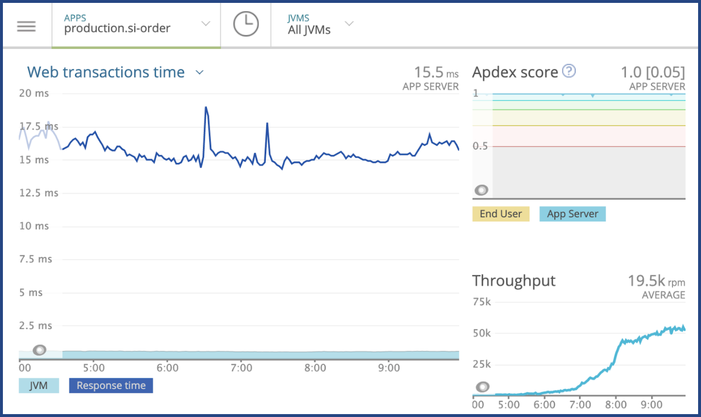
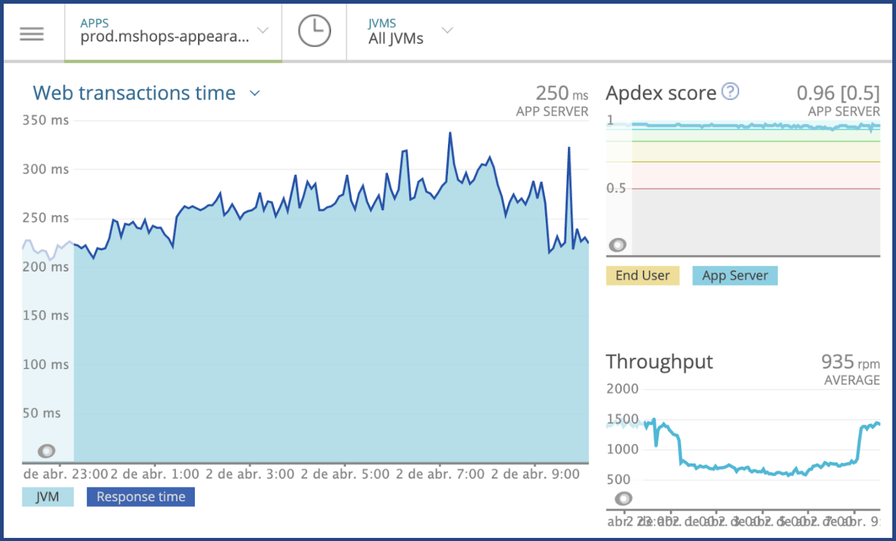

# Utilização do Kotlin dentro do Mercado Livre

Abaixo segue alguns exemplos de aplicações usando Kotlin para backend no Mercado Livre, uma usá programação reativa com Usa WebFlux e Clean Arch e a outro o modelo tradicional

## Seller Invoice

**Alguns links da aplicação si-order**

* [New Relic](https://rpm.newrelic.com/accounts/989586/applications/344662517)
* [GitHub](https://github.com/mercadolibre/fury_si-order)
* [Fury](https://web.furycloud.io/#/si-order/general)

_Métricas no New Relic da aplicação si-order_

## Mercado Shop

**Alguns links da aplicação appearance-api**

* [New Relic](https://rpm.newrelic.com/accounts/989586/applications/96823610)
* [GitHub](https://github.com/mercadolibre/fury_mshops-appearance-api)
* [Fury](https://web.furycloud.io/#/mshops-appearance-api/general)

_Métricas no New Relic da aplicação appearance-api_