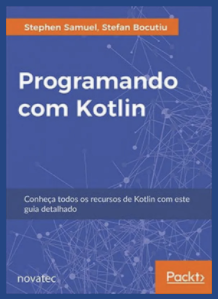

# Grupo de estudos

A ideia é fazer um grupo de estudo semanal, qual estudaremos a linguagem profundamente através do livro `Programando com Kotlin`, aonde cada pessoa estudaria e apresentaria semanalmente um tópico ou capítulo do livro. 

**Programando com Kotlin**

**Divisão**

Ideia de divisão por semana, como descrito nesta [planilha](https://docs.google.com/spreadsheets/d/1yevzB6-KBUJsaYDE-_kM0IDQEp4ThbVJldlQfbyeBho/edit?usp=sharing).

# Referências

* https://www.netguru.com/blog/kotlin-java-which-one-you-should-choose-for-your-next-android-app
* https://kotlinlang.org/docs/reference/comparison-to-java.html
* https://arctouch.com/blog/kotlin-vs-java/
* https://medium.com/android-dev-br/utilizando-kotlin-coroutines-no-android-c73fcda71e27

Adicionar referências dos livros, cursos e sites que foram usados para montar essa documentação - **WIP/TODO/PENDÊNCIA**  - _Pendente: **André Justi**_