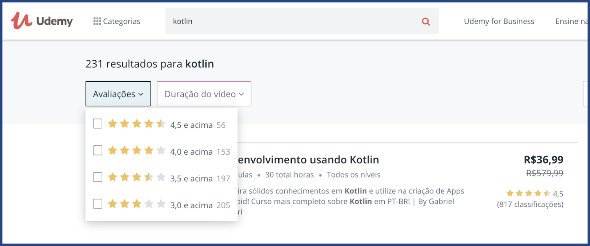
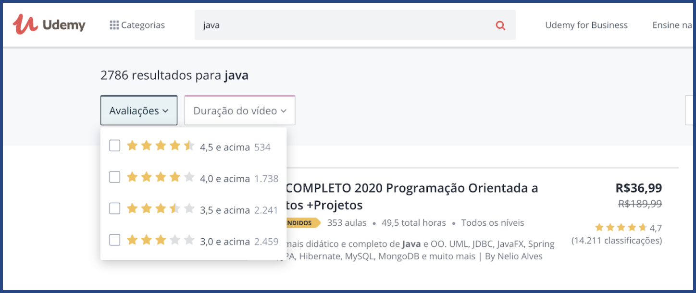
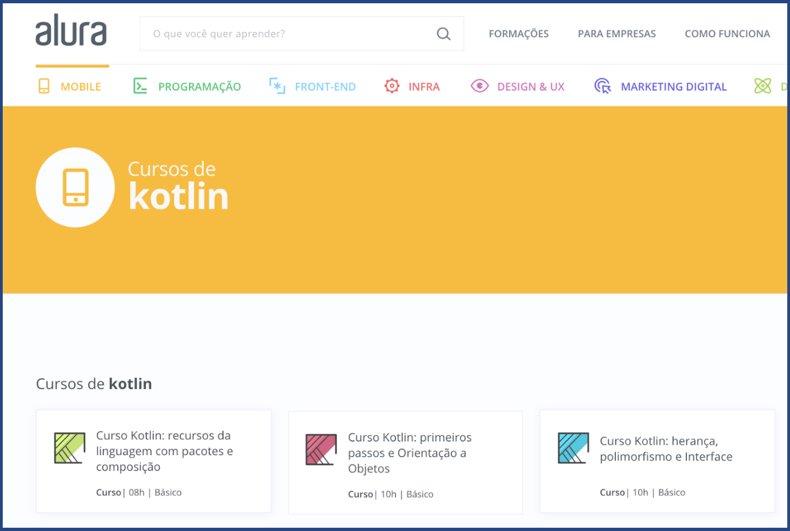
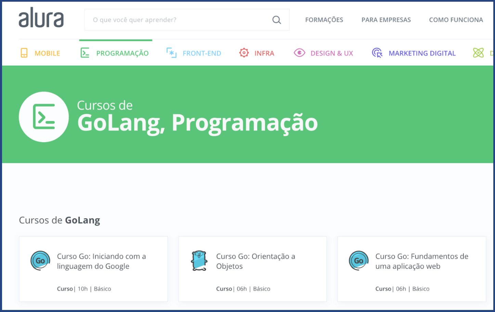
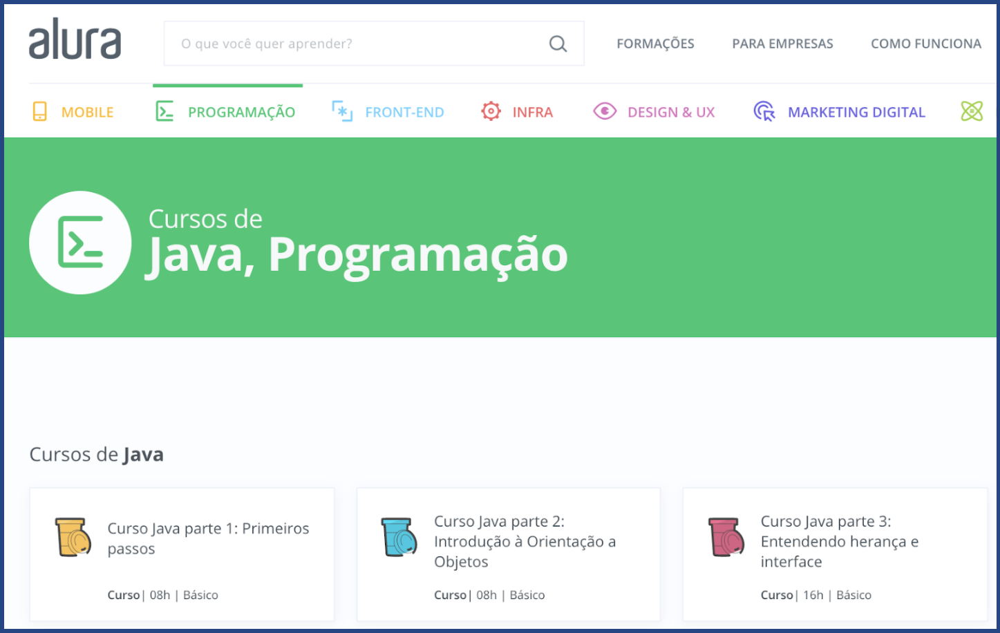

# Capacitações

Fazendo uma breve pesquisa notamos que tanto Kotlin, quanto Java e Go, possuem muito material para estudo, tanto gratuito quanto pago, abaixo está listado a quantidade de cursos para cada linguagem nas principais plataformas de estudo, e também é encontrado muitos outros materiais sobre as 3 linguagens, com [livros](https://kotlinlang.org/docs/books.html), vídeos [tutoriais](https://kotlinlang.org/docs/tutorials/) no Youtube etc.

## Udemy

_[Cursos de Kotlin na Udemy](https://www.udemy.com/courses/search/?q=kotlin&src=sac&kw=kotlin) (231 cursos)_

_[Cursos de Golang na Udemy](https://www.udemy.com/courses/search/?q=golang&src=sac&kw=go) (106 cursos)_

_[Cursos de Java na Udemy](https://www.udemy.com/courses/search/?q=java&src=sac&kw=java) (2786 cursos)_

## Alura

_[Cursos de Kotlin na Alura](https://www.alura.com.br/cursos-online-mobile/kotlin) (6 cursos)_

_[Cursos de Golang na Alura](https://www.alura.com.br/cursos-online-programacao/golang) (3 cursos)_

_[Cursos de Java na Alura](https://www.alura.com.br/cursos-online-programacao/java) (79 cursos)_

## Outras plataformas

Também existe muito conteúdo avançado sobre Kotlin em outras plataformas, como esses citados abaixo, sendo um deles feito pelo próprio criador da linguagem.

* [Coursera - Kotlin for Java Developers](https://www.coursera.org/learn/kotlin-for-java-developers)
* [Udacity - Kotlin Bootcamp for Programmers by Google](https://www.udacity.com/course/kotlin-bootcamp-for-programmers--ud9011)